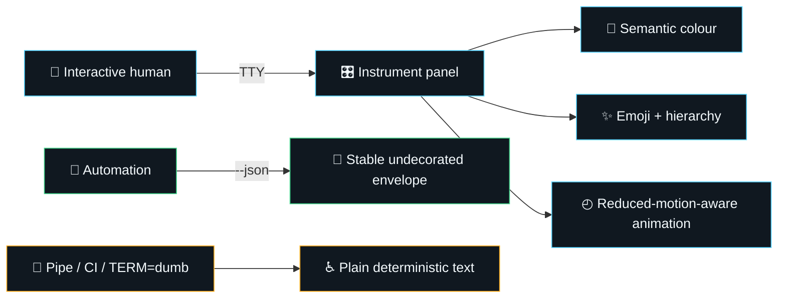

# InGauge state-of-the-art assessment

  <strong>📊 Overall: 85/100 · A− · production-ready</strong> 
  🟢 strong core · 🟠 delivery gaps · 🔵 measured on 22 August 2026

> **Assessment boundary:** InGauge is a credible production core, not yet a state-of-the-art release system. Its strongest qualities are deterministic domain logic, bounded provider I/O, secret-safe discovery, resilient SQLite operations, a stable automation contract, and unusually coherent terminal presentation. Its main gaps are independent CI evidence, release provenance, coverage depth, performance regression gates, and explicit service objectives.

## Scorecard

Scores use five evidence levels: 🟢 **SOTA (9–10)**, 🔵 **strong (8–8.9)**, 🟠 **capable (7–7.9)**, 🟡 **developing (5–6.9)**, and 🔴 **blocking (<5)**. Every criterion has equal weight.

| # | Criterion | Grade | Evidence | SOTA gap |
|---:|---|---:|---|---|
| 1 | 🧭 Product clarity and scope | **9.0/10** | A focused capacity-observability mission, canonical bridge contract, explicit non-goals, and versioned JSON envelope | Publish a compatibility matrix and measured adopter outcomes |
| 2 | 🏗️ Architecture and maintainability | **8.9/10** | Fract: **88.9/100**, 18 modules, 0 critical, 13 healthy, 5 warning | Reduce duplication in `config`, `admission`, `model`, and `ingauge-gate`; split BYOK discovery policy from mechanics |
| 3 | ✅ Correctness and reliability | **9.0/10** | Typed models, bounded parsing, transactional migrations, deterministic forecasting, graceful signals, retry bounds, offline CI gate | Add fault-injection, clock-skew, disk-full, corrupt-WAL, and long-soak evidence |
| 4 | 🔐 Security and supply chain | **8.0/10** | HTTPS boundary, secret references, hardened systemd unit, threat model, unsafe forbidden, cargo-deny policy, Poka secret scanning | Generate SBOM and SLSA provenance, sign artifacts/tags, pin Actions by digest, and archive advisory evidence |
| 5 | ⚡ Performance and scalability | **7.5/10** | Release LTO, bounded bodies/records/history, indexed SQLite, deterministic microbenchmarks | Establish throughput/latency baselines, concurrency saturation tests, memory ceilings, and regression budgets |
| 6 | 🧪 Testing and quality engineering | **8.5/10** | Unit/integration tests, CLI contract tests, docs-as-errors, Clippy warnings denied, release build in gate | Add coverage threshold, mutation score, fuzz targets, Miri, sanitizer runs, and cross-platform matrix |
| 7 | 🎨 UX, accessibility, and output contracts | **9.5/10** | Brandi **100/100** across 630 surfaces; semantic true-colour, emoji, panels, animation, `NO_COLOR`, reduced motion, TTY detection, clean JSON | Add snapshot tests across terminal capabilities and screen-reader-oriented plain mode guidance |
| 8 | 📚 Documentation and developer experience | **8.5/10** | Quick start, operations, migrations, threat model, man page, completion, example config, skill packaging | Add architecture decision records, contributor guide, API examples, troubleshooting matrix, and release runbook |
| 9 | 🛰️ Observability and operations | **8.5/10** | Structured tracing, correlation spans, heartbeat health, integrity/checkpoint/backup, retention, reload, service hardening | Export OpenMetrics, define SLOs/alerts, propagate probe IDs end-to-end, and test backup restoration continuously |
| 10 | 🚢 Release, governance, and ecosystem | **7.5/10** | Kaptaind change analysis, qualification hook, semantic versioning, package metadata, optional admission crate, Padagonia export | Enforce protected CI, publish signed multi-architecture artifacts, automate changelogs, and verify install/upgrade paths |

**Weighted result:** `(9.0 + 8.9 + 9.0 + 8.0 + 7.5 + 8.5 + 9.5 + 8.5 + 8.5 + 7.5) / 10 = 8.49`, rounded to **85/100**.

## Evidence snapshot

- 🟢 `scripts/ci.sh` gates format, Clippy, all targets/features, tests, rustdoc, and a locked offline release build.
- 🟢 Brandi reports **100/100**: repository docs 100, docs 100, UI strings 100, with no findings.
- 🟢 Fract reports **88.9/100**, no critical module, and no module over its refactor threshold.
- 🟠 Amber identified replaceability candidates—especially `chrono` and `thiserror`—but both are materially used. Replacement is a roadmap experiment, not an automatic removal.
- 🟠 The local Cargo advisory scan could not refresh its upstream database in the isolated assessment environment. Secret scanning is configured, but current vulnerability evidence must be produced in connected CI before release.
- 🟠 Kaptaind shipping was previously disabled; the repository now declares qualification-gated binary shipping with SBOM and provenance generation.

## Output-system verdict

Decoration is deliberately limited to human presentation. JSON, logs consumed as records, and redirected output remain stable and ANSI-free; applying emoji or animation there would be a contract regression rather than an improvement.

## Release recommendation

🟢 **Ship a qualified preview release.** The core is production-worthy for single-host inference capacity observation when deployed within the documented trust model.

🟠 **Do not claim SOTA yet.** Promote to that label only after the roadmap’s P0 and P1 evidence gates are green and reproducible from a clean connected runner.
